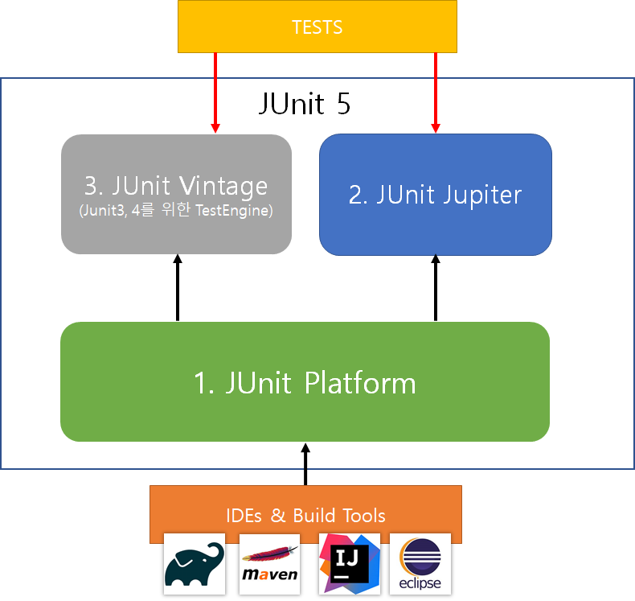
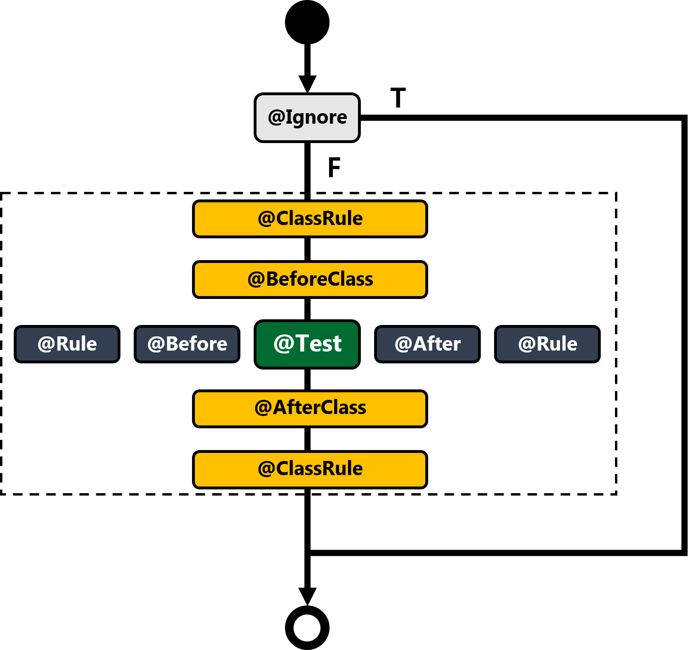

# Junit5 Test 정리

---

### 자바 기반 테스팅 프레임워



- Platform: 테스트를 실행해주는 런처 제공, TestEngine Api 제공
- Jupiter: TestEngine API 구현체로 JUnit 5를 제공
- Vintage: JUnit 4와 3을 지원하는 TestEngine 구현체

- 스프링부트 2.2 이후 버전 부터는 기본적으로 Junit 5의 의존성 추가 되어 있음

---

## 기본 애노테이션


- @Test 
  - 해당 메서드를 테스트 대상이라고 지정하는 annotation
- @BeforeAll / @AfterAll
  - 모든 테스트가 시작 전에 최초로 한번 실행
  - 모든 테스트가 끝난 후 한번 실행
- @BeforeEach / @AfterEach
  - 클래스 내에 존해자는 각가의 @Test를 실행하기 전에 매번 실행
  - 클래스 내에 존해자는 각가의 @Test를 실행하기 후에 매번 실행
- @Disabled
  - 적용된 test는 실행이 되지 않음
- @DisplayName
  - 어떤 테스트인지 테스트 이름을 보다 쉽게 표현할 수 있는 방법을 제공하는 애노테이션.
  -  @DisplayNameGeneration 보다 우선 순위가 높다.

- org.junit.jupiter.api.Assumptions.*
  -  assumeTrue(조건)
  -  assumingThat(조건, 테스트)
- @Enabled___ 와 @Disabled___ 
  - OnOS
  - OnJre
  - IfSystemProperty
  - IfEnvironmentVariable 
  - If

---
## JUnit 5: Assertion


```JUint5
 org.junit.jupiter.api.Assertions.*
```

- 실제 값이 기대한 값과 같은지 확인
```JUint5
 assertEqulas(expected, actual)
```

- 값이 null이 아닌지 확인
```JUint5
 assertNotNull(actual)
```

- 다음 조건이 참(true)인지 확인
```JUint5
 assertTrue(boolean)
```

- 모든 확인 구문 확인
```JUint5
 assertAll(executables...)
```

- 예외 발생 확인
```JUint5
 assertThrows(expectedType, executable)
``` 

- 특정 시간 안에 실행이 완료되는지 확인
```JUint5
 assertTimeout(duration, executable)
``` 

---

## ⛓️ 참고 자료

---
- https://gmoon92.github.io/test/2018/11/04/junit.html
- 더자바 코드를 테스트하는 다양한 방법_백기선 강의